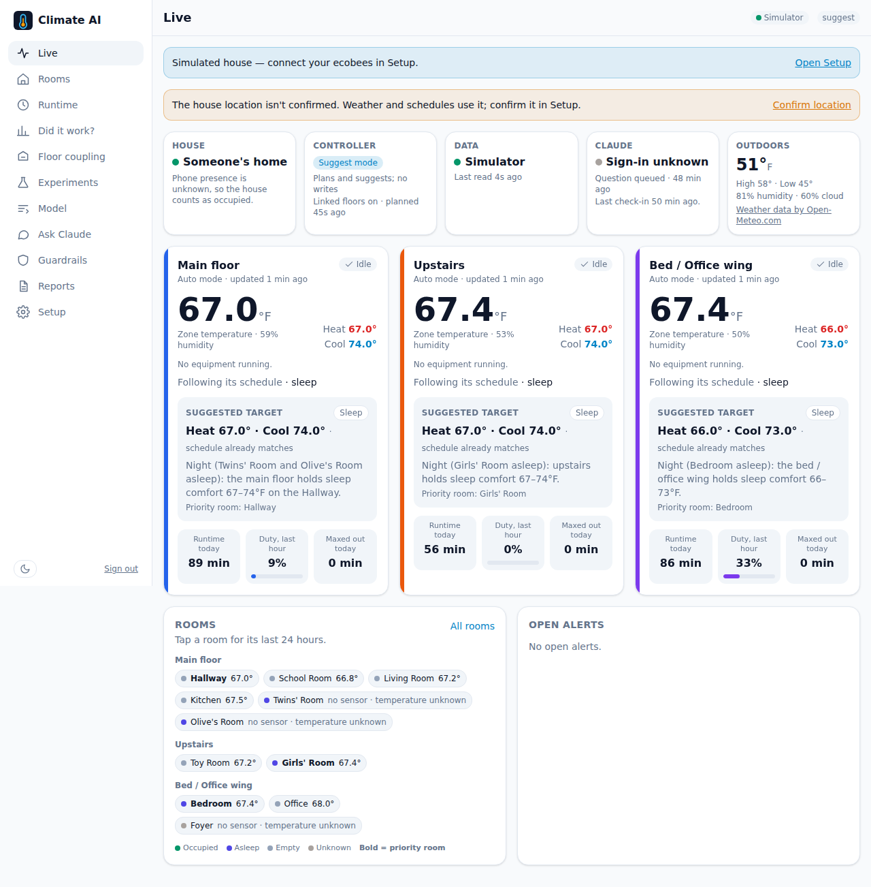
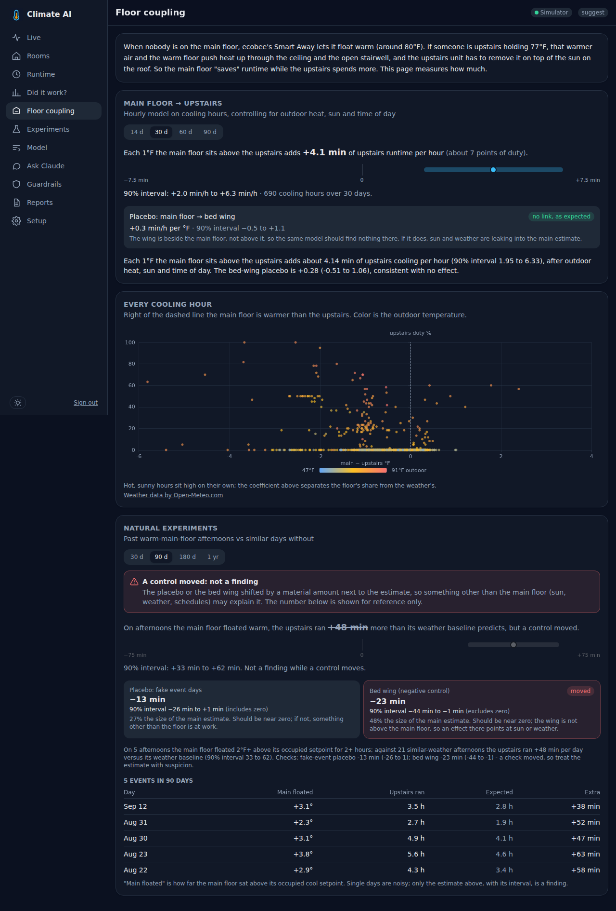
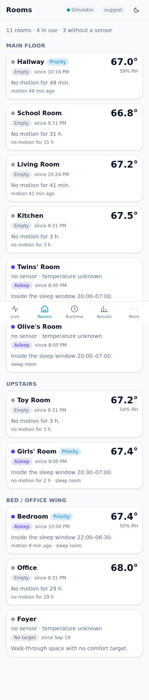

# Climate AI

One brain for three ecobees. Climate AI monitors every thermostat and room sensor in the house
(ecobee cloud plus local HomeKit), separates weather from strategy with weather-normalized
baselines, learns how the floors push heat into each other, and adjusts schedules to minimize
total HVAC runtime while occupied rooms stay comfortable. A deterministic controller enforces
every limit; Claude Opus 5.5, running on the owner's own Claude subscription through the Claude
Agent SDK, reviews the results a few times a day, explains them and proposes experiments, but
is never in the control path.

Screenshots from the built-in simulated house (no credentials needed):

| Live | Floor coupling | Rooms (phone) |
|---|---|---|
| [](docs/img/live.png) | [](docs/img/coupling.png) | [](docs/img/rooms-phone.png) |

## Quickstart (simulator, no credentials needed)

On a Mac (Apple Silicon or Intel, with [Docker Desktop](https://docs.docker.com/desktop/setup/install/mac-install/))
or a Linux machine (with Docker Engine and the Compose plugin):

```bash
git clone <your repo URL> climate-ai && cd climate-ai
make bootstrap
```

`make bootstrap` (= `scripts/bootstrap.sh`, safe to run again any time) creates `.env` with
every secret generated (never printed, file mode 600), picks free ports if the defaults are
taken, builds and starts the stack, waits until it is healthy and prints the address. Open
<http://localhost:8470> (or the port it printed) and **choose the owner password** on the first
screen. That works only from this computer, your home network or Tailscale, so nobody on the
internet can claim the house first. Then explore the simulated house.

One login, no user accounts: the owner password is stored only as an Argon2id hash, signing in
issues real bearer tokens (15-minute access tokens plus a per-device refresh cookie that
rotates), and services get their own revocable API tokens (More > Security, or
`make token NAME=... ROLE=viewer`). Spec: [`docs/specs/users-and-tokens.md`](docs/specs/users-and-tokens.md).

`make help` lists the everyday commands (`logs`, `doctor`, `password`, `down`, `reset`, `test`,
`dev` ...). Phones on your Wi-Fi: `scripts/bootstrap.sh --lan`. Next steps:

- **[docs/LOCAL_DEVELOPMENT.md](docs/LOCAL_DEVELOPMENT.md)**: running it on a Mac or a Linux
  box, HomeKit on a Mac (`make homekit-native`), development with live reload, tests,
  troubleshooting.
- **[docs/DEPLOY.md](docs/DEPLOY.md)**: the home server: HTTPS behind your nginx, signed-in
  devices and API tokens, connecting ecobee and HomeKit, signing Claude in, backups, updates.
- **[docs/PUBLIC_ACCESS.md](docs/PUBLIC_ACCESS.md)**: a public name through the GrowWise
  AppRelay gateway, and what must hold before it goes live.

To see how the app handles a utility energy-saving event, announce one in the simulated house:

```bash
docker compose exec app python -m climate.cli sim-event --unit up,main --in-min 30 --hours 2 --cool-offset 2
docker compose exec app python -m climate.cli sim-event --clear   # remove it again
```

## Architecture

Docker Compose on one home server (or a Mac); every port binds to `127.0.0.1`, and a reverse
proxy in front of the app (your nginx, or the GrowWise AppRelay gateway for a public name) is
the front door.

| Service | Command | Role |
|---|---|---|
| `db` | TimescaleDB 2.30.2 on PostgreSQL 16 | Readings, runtime, occupancy, weather, policies, experiments, control log, reports |
| `app` | `uvicorn climate.api.app:app` | REST API under `/api`, websocket `/api/ws`, and the built Vue 3 PWA at `/`; migrates on start |
| `worker` | `python -m climate.worker` | ecobee cloud (or simulator), Open-Meteo weather, analytics, the controller, nightly jobs |
| `homekit` | `python -m climate.collector.homekit_service` | Local HomeKit controller for the thermostats and SmartSensors (host network, profile `homekit`, Linux; on a Mac `make homekit-native`) |
| `agent` | `python -m climate_agent.scheduler` | Claude analyst on the owner's subscription; talks to the API with an agent-role token, no database access |
| `mcp` | `python -m climate_agent.mcp_server --http 0.0.0.0:8471` | The same tools for Claude Code / Desktop (profile `mcp`) |
| `ntfy` | `binwiederhier/ntfy` | Optional self-hosted push notifications (profile `ntfy`) |

The iPhone app in [`ios/`](ios/README.md) is a thin WKWebView wrapper around the same web app;
"Add to Home Screen" from Safari works too, without Xcode.

## Documentation

- [`docs/BLUEPRINT.md`](docs/BLUEPRINT.md): the plan of record (house, control rules, occupancy,
  learning loop, weather normalization, Claude integration, architecture, roadmap)
- [`docs/blueprint.html`](docs/blueprint.html): the same plan with a working mockup of the app
  (open it in a browser)
- [`docs/BUILD.md`](docs/BUILD.md): code layout, processes and the API contract
- [`docs/LOCAL_DEVELOPMENT.md`](docs/LOCAL_DEVELOPMENT.md): `make bootstrap` on a Mac or Linux,
  native HomeKit on a Mac, live-reload development, tests, troubleshooting
- [`docs/DEPLOY.md`](docs/DEPLOY.md): the home server: secrets, the owner password, devices and
  API tokens, nginx + HTTPS, public access, Tailscale, ecobee, Claude, MCP, backups, updating
- [`docs/PUBLIC_ACCESS.md`](docs/PUBLIC_ACCESS.md): a public name through the GrowWise AppRelay
  gateway
- [`docs/specs/users-and-tokens.md`](docs/specs/users-and-tokens.md): the owner login, signed-in
  devices and API tokens
- [`docs/HOMEKIT.md`](docs/HOMEKIT.md): pairing the thermostats locally, with what is verified
  and what is not
- [`ios/README.md`](ios/README.md): building the iPhone wrapper

## Safety principles

- **Claude is never in the control path.** Models and the controller make every real-time
  decision; Claude verifies, explains and proposes on a schedule (nightly, weekly, at most three
  triggered runs a day, on request). If Claude is unavailable, changes wait and the house keeps
  running.
- **Claude never writes to a thermostat.** Its tools can only queue proposals or sign off / hold
  model-queued changes inside pre-approved ranges, and every change passes backtest, simulation,
  shadow days and a trial window first.
- **Guardrails in code.** Every write goes through hard limits (setpoint range, at most one
  change per unit per 30 minutes and 2 °F per change, humidity, no short cycling) before it is
  sent.
- **Read back every write.** Only timed holds of 1-2 hours, renewed while healthy; every write is
  read back and logged in `control_actions` with the channel, reason, before/after values and
  read-back result. If the server dies, holds expire and each ecobee runs its own schedule.
- **Occupied rooms first; uncertain means occupied.** No savings claim without weather
  normalization and a 90% interval. No invented temperatures for rooms without a sensor.
- **Your subscription, not an API key.** The agent runs on `CLAUDE_CODE_OAUTH_TOKEN` and refuses
  to start if `ANTHROPIC_API_KEY` is set.
- **Private by default, public only on purpose.** Every port binds to `127.0.0.1`; the database,
  MCP and ntfy never leave the machine. The app is reached at home, over Tailscale, or through
  a reverse proxy with HTTPS. A public name goes only through the GrowWise gateway, after the
  owner password is chosen from home, with Secure cookies, rate limits in front of sign-in and
  API tokens that work from home only unless you say otherwise ([docs/DEPLOY.md](docs/DEPLOY.md),
  "Public access"). Secrets are encrypted at rest; the password is an Argon2id hash.

Weather data by [Open-Meteo.com](https://open-meteo.com/).

## License

Private. All rights reserved.
